### Lit Element Project

A modular and responsive UI built using Lit and custom Web Components for managing employee data. Designed with scalability, accessibility, and maintainability in mind.

### Features

- Internationalization (i18n) support
- **Light & Dark** theme toggle
- Dynamic form validations (phone, email, required, unique)
- Search and filter functionality
- Fully responsive design
- Reactive state management using **Zustand**
- Custom reusable components (my-input, my-button, my-select, etc.)
- Routing by using **@vaadin/router**
- Commit message check thanks to **husky**
- Unit test coverage more than 90%.

### Project

```sh
src/
├── assets/            # Project assets
├── components/        # UI components like inputs, buttons, selects, modals
├── constants/         # Constant data (regex, router, message etc)
├── data/              # Project data employee data
├── patterns/          # Page-level components like Employee list and form
├── store/             # Global reactive state and subscriptions
├── i18n/              # Language files and translation setup
├── utils/             # Utility functions (debounce, resizeObserver, etc.)
├── styles/            # Global CSS variables and themes
```

### Tech Stack

- `Lit – Modern Web Components` library for building fast, lightweight components
- `@vaadin/router` – Client-side routing for seamless navigation
- `Zustand` – Simple and scalable global state management with persistence support
- `Vitest + @open-wc/testing` – Fast unit testing optimized for Web Components
- `Storybook` – Interactive component documentation and playground
- `Husky` – Git hooks for enforcing commit standards and code quality

### Commit Message
To maintain a clean and understandable Git history, please follow this commit message format:
```sh 
<type>: <short summary> # type => feat | fix | docs | style | refactor | test | chore

"fix bugs"  # invalid
"test"  # invalid
"feat: implemented button component" # valid
"fix: storybook color has been fixed" # valid 
```

### Language & Localization

This project includes built-in internationalization (i18n) support to provide a seamless multi-language experience.

- Text content is managed via a centralized i18n module using key-based translation.
- Language strings are defined in separate JSON files for each supported locale (e.g., en.json, tr.json).
- The current language is stored in a global state and persists across sessions.
- Users can toggle between supported languages dynamically via the UI.
<p align="center">
  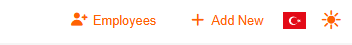
  
</p>

### Theme Support

This project supports light and dark themes to enhance user experience across different environments.

- Theme preference is stored in a global store and is persisted locally.
- The UI responds dynamically to theme changes without reloading the page.
- Themes are applied via CSS custom properties (body css variables), ensuring clean and maintainable styles.
- A toggle button allows users to switch themes instantly.

<p align="center">
  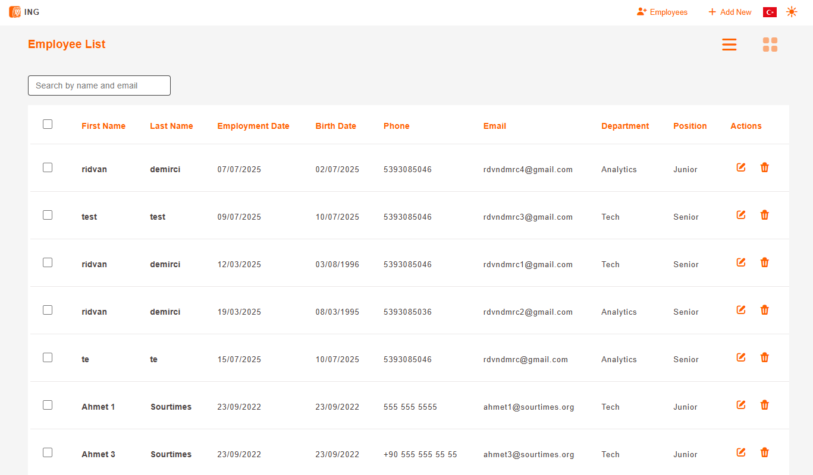
  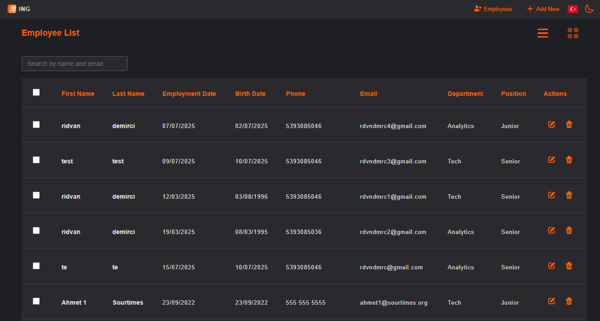
</p>

### Documentation (Storybook)

Our project uses Storybook to document and showcase all UI components in an isolated environment. Storybook enables developers and designers to:

- Visualize components independently without running the entire application.
- Interactively test different states and props of components.
- Maintain a single source of truth for UI elements, promoting consistency and reusability.
- Facilitate collaboration between developers, designers, and stakeholders by providing a live, browsable component library.
- Generate automatic documentation including usage examples, controls, and accessibility checks.

- By integrating Storybook, we improve development efficiency and ensure UI quality across the application. To start Storybook locally, run:

```sh
npm run storybook
```

<p align="center">
  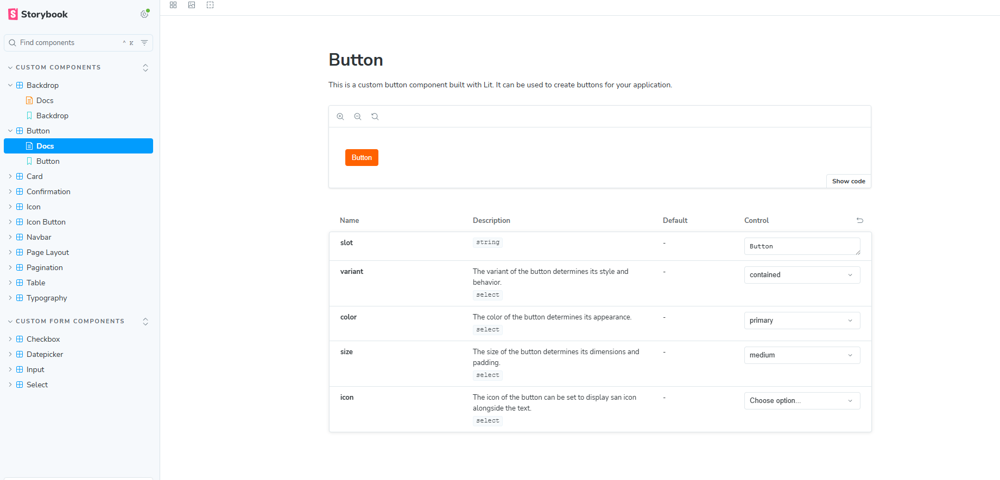
</p>

### Usage (installation)

To get started with the project, follow these simple steps to install and run the application locally:

#### Install dependencies:

```sh
npm install
```

#### Run the development server:

```sh
npm run dev # for web application
npm run storybook # for web storybook documentation
```

### Test

- To ensure the application works correctly, you can run the test suite with the following commands:

```sh
npm run test
```

<p align="center">
  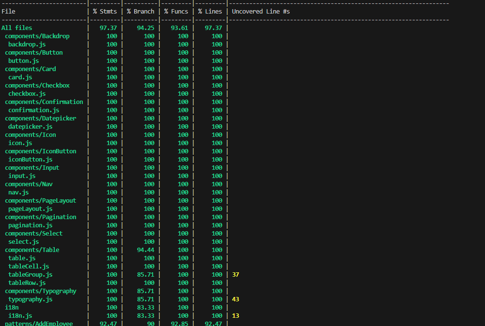
</p>

### Project pictures

Below are some screenshots demonstrating the UI and key features of the project:

<p align="center">
  
  
</p>

<p align="center">
  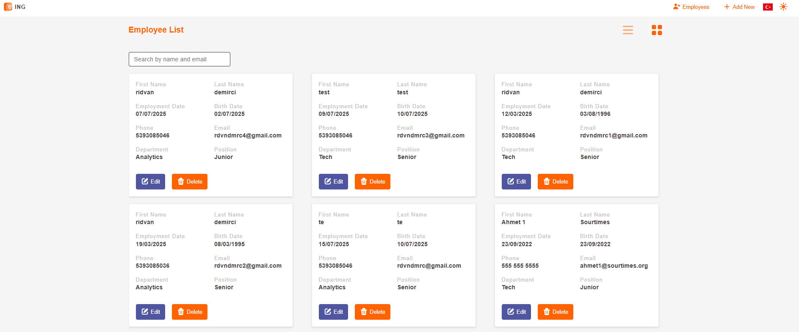
  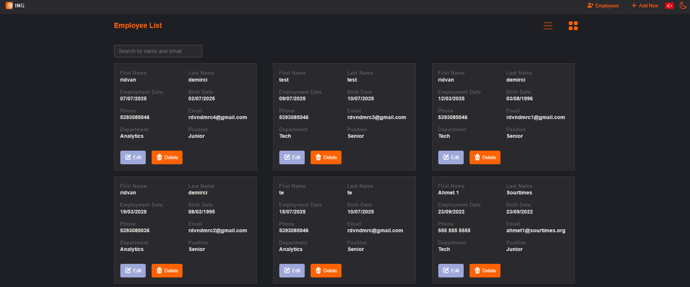
</p>

<p align="center">
  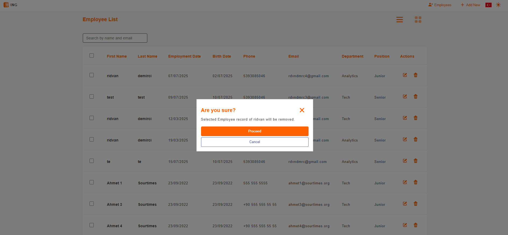
  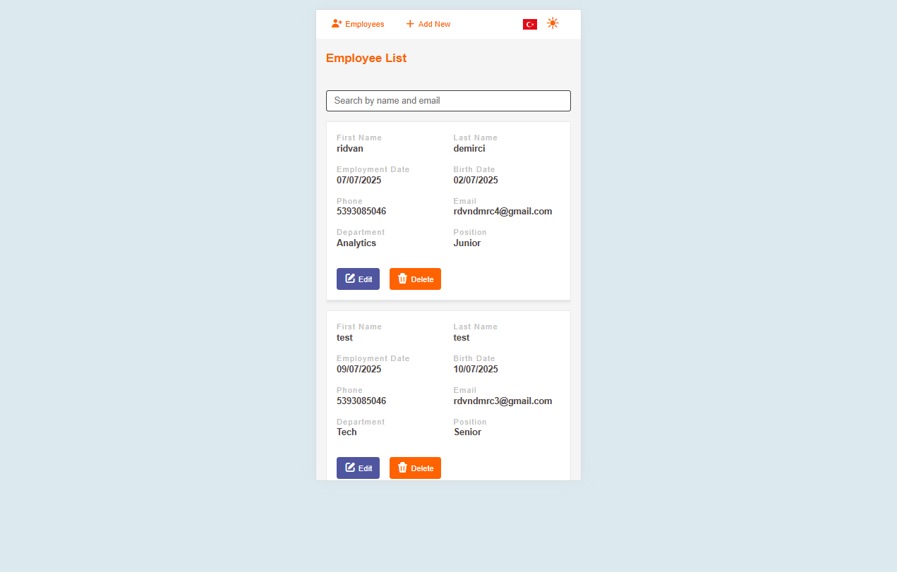
</p>

<p align="center">
  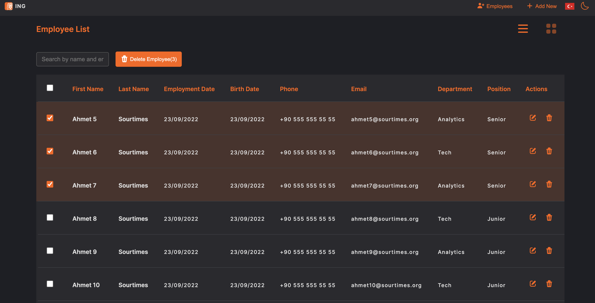
  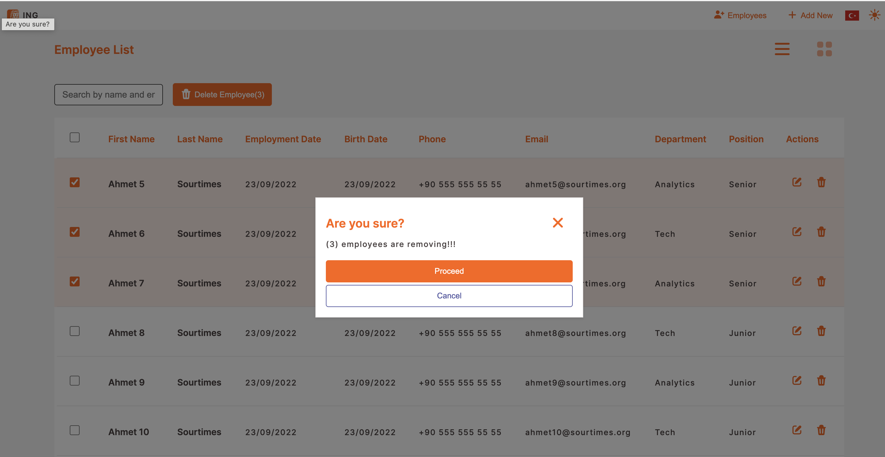
</p>

<p align="center">
  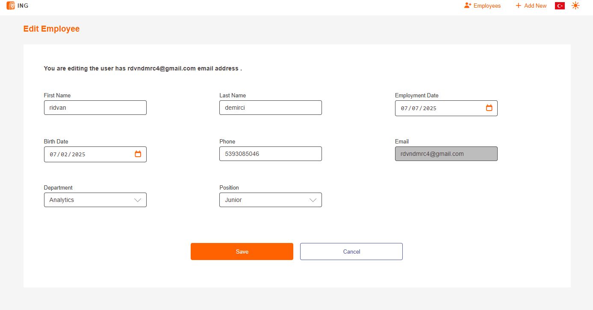
  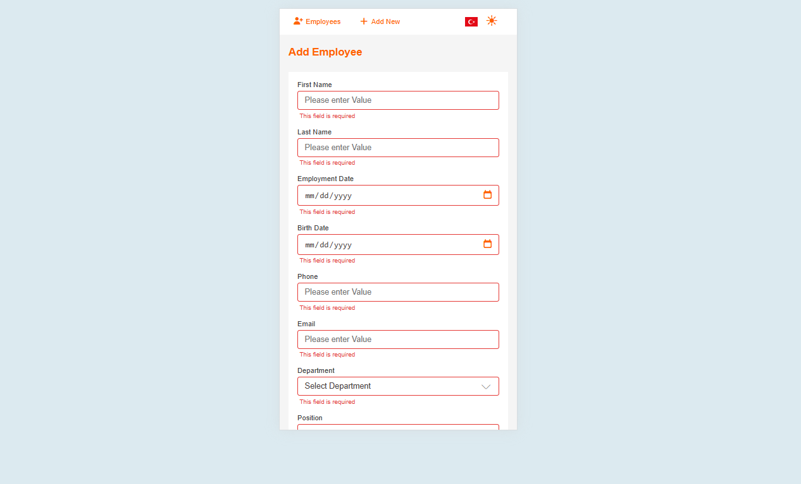
</p>
